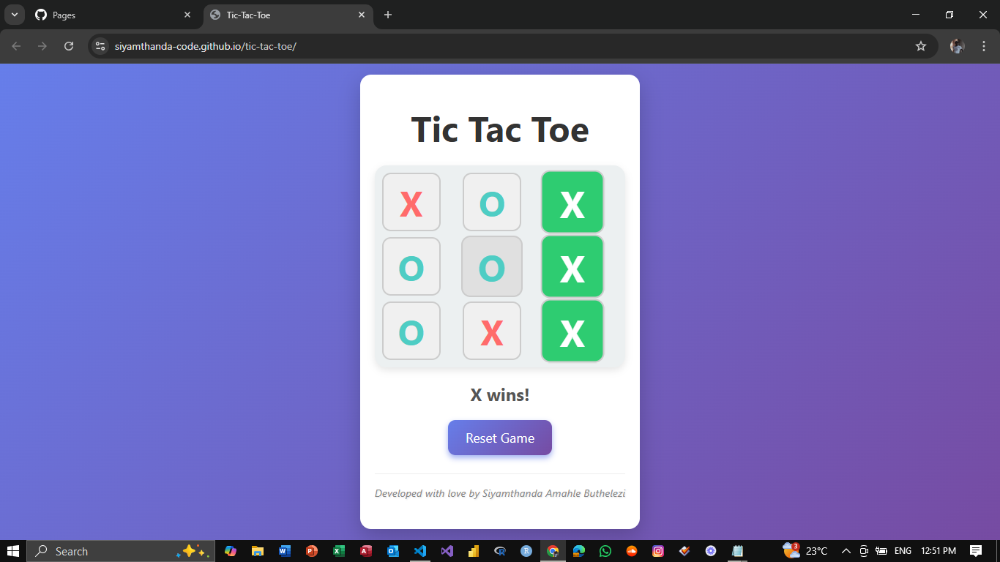

# Tic-Tac-Toe Game

A simple, interactive Tic-Tac-Toe game built with HTML, CSS, and JavaScript. This project allows two players to play the classic Tic-Tac-Toe game in the browser with a clean and responsive design.


---

## Demo

Open the `index.html` file in any modern web browser to play the game.

---

## Features

- Responsive 3x3 grid game board.
- Two-player gameplay (X and O).
- Visual indication of the current player.
- Highlights the winning combination.
- Detects draw situations.
- Reset button to start a new game.
- Smooth animations and hover effects.
- Mobile-friendly design with touch support.

---

## Installation

1. Clone the repository or download the source code:
```bash
git clone https://github.com/yourusername/tic-tac-toe.git
```
2. Navigate to the project directory:
```bash
cd tic-tac-toe
```
4. Open index.html in your preferred web browser.

---

## Usage
- Click on any empty cell to place your mark (X or O).
- Players alternate turns automatically.
- The game announces the winner or a draw.
- Click the Reset Game button to start over
